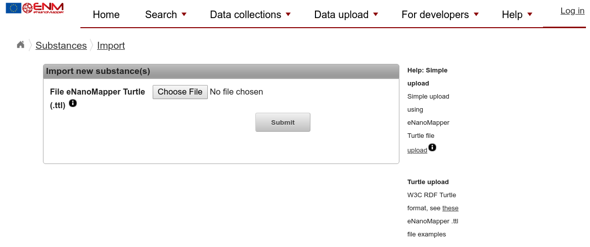
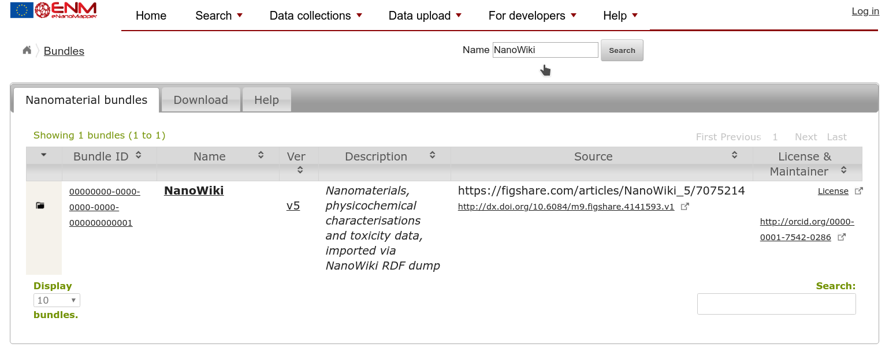

# Adding nanomaterial data
<script type="application/ld+json">
  {
    "@context": "https://schema.org/",
    "@type": "LearningResource",
    "http://purl.org/dc/terms/conformsTo": { "@type": "CreativeWork", "@id": "https://bioschemas.org/profiles/TrainingMaterial/1.0-RELEASE" },
    "name": "Adding nanomaterial data",
    "version": "0.9.3",
    "description": "This tutorial describes how nanomaterial data can be added to an eNanoMapper server using a RDF format.",
    "license": "https://creativecommons.org/licenses/by/4.0/",
    "keywords": "ontologies, enanomapper, RDF",
    "url": "https://enanomapper.github.io/tutorials/enteringData/",
    "provider": {
      "@type": "Organization",
      "name": "NanoCommons",
      "url": "https://www.nanocommons.eu/"
    },
    "audience": {
      "@type": "EducationalAudience",
      "educationalRole": "Graduates"
    },
    "inLanguage": {
      "@type": "Language",
      "name": "English",
      "alternateName": "en"
    },
    "author": [
      {
        "@context": "https://schema.org",
        "@type": "Person",
        "name": "Egon Willighagen",
        "identifier": "https://orcid.org/0000-0001-7542-0286",
        "orcid": "https://orcid.org/0000-0001-7542-0286"
      }
    ]
  }
</script>


* Author: Egon Willighagen (orcid:[0000-0001-7542-0286](https://orcid.org/0000-0001-7542-0286))
* License: [CC-BY 4.0](https://creativecommons.org/licenses/by/4.0/)
* Version: 0.9.3
* Source: [https://github.com/NanoCommons/tutorials/blob/master/enteringData/index.md](https://github.com/NanoCommons/tutorials/blob/master/enteringData/index.md)

Adding nanomaterial data to an eNanoMapper instance can be done in many different ways, as one would
expect in a open platform. Data can be entered using the JRC spreadsheet formats, using R code and
the eNanoMapper application programming interface (API), and, as done in this tutorial in the
Resource Description Framework (RDF) format, using a schema based on various ontologies.

This tutorial expects some basic knowledge about RDF, particularly, the concept of IRIs and triples.
The examples used will illustrate a lot, but does not replace reading up on RDF literature. If new
to this, and if something in not clear when you go through the tutorial below, you consider
reading [RDF 1.1 Turtle - Terse RDF Triple Language](https://www.w3.org/TR/turtle/).

Furthermore, because RDF is a semantic format, it will rely on the eNanoMapper ontology. At various
places it will link to the EMBL-EBI Ontology Lookup Service (OLS) to show a term. Besides the OLS
BioPortal can be used to browse the ontology too. The reader may be interested in the
[Browsing the eNanoMapper ontology with BioPortal, AberOWL and Protégé](https://enanomapper.github.io/tutorials/BrowseOntology/Tutorial%20browsing%20eNM%20ontology.html)
tutorial.

## Turtle and namespaces

To shorten the RDF statements in this tutorial, it will depend on the use of namespace. The following
two documents are identical, using the `@prefix` command to define the namespaces:

```turtle
<https://nanocommons.github.io/tutorials/demo/owner/NT18-DS> <http://www.w3.org/1999/02/22-rdf-syntax-ns#type>  <http://rdfs.org/ns/void#Dataset> .
```

and

```turtle
@prefix owner: <https://nanocommons.github.io/tutorials/demo/owner/> .
@prefix rdf:   <http://www.w3.org/1999/02/22-rdf-syntax-ns#> .
@prefix void:  <http://rdfs.org/ns/void#> .
@prefix dcterms: <http://purl.org/dc/terms/> .

owner:NT18-DS rdf:type void:Dataset .
```

Because `rdf:type` is frequently used, the Turtle standard allows it to be shortened to a mere `a`, so that
the triple can be further shortened to (just the triple, so ommiting the namespace declarations):

```turtle
owner:NT18-DS a void:Dataset .
```

### Namespaces used in this tutorial

Because using namespaces makes the RDF more readable, this tutorial uses the following namespaces:

```turtle
@prefix bao:   <http://www.bioassayontology.org/bao#> .
@prefix cito:  <http://purl.org/net/cito/> .
@prefix dc:    <http://purl.org/dc/elements/1.1/> .
@prefix dcterms: <http://purl.org/dc/terms/> .
@prefix foaf:  <http://xmlns.com/foaf/0.1/> .
@prefix npo:   <http://purl.bioontology.org/ontology/npo#> .
@prefix obo:   <http://purl.obolibrary.org/obo/> .
@prefix owner: <https://nanocommons.github.io/tutorials/demo/owner/> .
@prefix rdf:   <http://www.w3.org/1999/02/22-rdf-syntax-ns#> .
@prefix rdfs:  <http://www.w3.org/2000/01/rdf-schema#> .
@prefix sio:   <http://semanticscience.org/resource/> .
@prefix void:  <http://rdfs.org/ns/void#> .
@prefix xsd:   <http://www.w3.org/2001/XMLSchema#> .
```

## Adding a dataset 

The first thing to do is define a dataset. The eNanoMapper software will read this as a `bundle`.
Each dataset has license statement, the name of the distributor (which is often different from the
copyright owner), a description (the `@en` annotation indicated the language), and a title. For example:

```turtle
owner:NT18-DS
        a                   void:Dataset ;
        dcterms:license     <https://creativecommons.org/publicdomain/zero/1.0/> ;
        dcterms:publisher   "Egon Willighagen"@en ;
        dcterms:description "Nanomaterials I am excited about."@en ;
        dcterms:title       "Exciting nanomaterials"@en .
```

Possible license IRIs include:

* CCZero: https://creativecommons.org/publicdomain/zero/1.0/
* CC-BY 4.0: https://creativecommons.org/licenses/by/4.0/

## Adding a nanomaterial 

But at this moment, the dataset is still empty. We did not add nanomaterials to it.
The very minimal amount of information is that the nanomaterial is a chemical substance,
and for that we will use the `chemical substance` term from the eNanoMapper ontology
([CHEBI_59999](https://www.ebi.ac.uk/ols/ontologies/enm/terms?iri=http%3A%2F%2Fpurl.obolibrary.org%2Fobo%2FCHEBI_59999)).
Furthermore, we will give the material a name and a ontology annotation, for which we also use the
eNanoMapper ontology (here, a 
[NPO_1542](https://www.ebi.ac.uk/ols/ontologies/enm/terms?iri=http%3A%2F%2Fpurl.bioontology.org%2Fontology%2Fnpo%23NPO_1542)):

```turtle
owner:NT18-S1
        a                obo:CHEBI_59999 ;
        rdfs:label       "zinc oxide" ;
        dcterms:source   owner:NT18-DS ;
        dcterms:type     npo:NPO_1542 .
```

This example is taken from a recent paper by the
[HINAMOX project](https://scholia.toolforge.org/sponsor/Q55095501)
(doi:[10.3390/ijms19010246](https://doi.org/10.3390/ijms19010246)).

To figure out what *type* of nanomaterial you have, you can browse the eNanoMapper ontology (see the aforementioned
tutorial). If you are using any of the OECD or JRC nanomaterials, you are lucky and can also use one of these
two guidance documents:

* [Ontology IRIs for the OECD nanomaterials](http://specs.enanomapper.net/oecd/)
* [eNanoMapper Ontology IRIs for the JRC representative industrial nanomaterials](http://specs.enanomapper.net/jrc/)

### Use Case: linking to third party databases

The above information does not sounds like a lot yet, but can still be useful. Say you have some data collection
online, with one web page for each material, and you want the eNanoMapper database to link to that. The above would
be enough, except that we would need to add the link to that web page. That can be done with the FOAF ontology:

```turtle
owner:NT18-S1 foaf:page <http://www.mdpi.com/1422-0067/19/1/246/htm>
```

For the running example, the page linked to is not specifically about that nanomaterial, but the page
of the full article.

## Adding some chemistry

There is plenty of room at the bottom, and that applies to this story too. The above basically only
covers the name of the compound, along with some metadata. Let's describe next what we know about
the chemical content of the material.

First, the full composition is modelled after the NPO ontology and each nanoparticle has parts, so
if we want to define a core part, we create a new resource for that, with out unique IRI, and link
that to the nanoparticle with `npo:has_part`.

### The core

Let's first define the core of that nanomaterial. For this we define a new resource, for the core,
and type it as a core using a term from the NPO ontology NPO

```turtle
owner:NT18-S1_core  a           npo:NPO_1597 ;
        sio:CHEMINF_000200  owner:NT18-S1_core_smiles .

owner:NT18-S1_core_smiles
        a               sio:CHEMINF_000018 ;
        rdfs:label      "zinc oxide" ;
        sio:SIO_000300  "ZnO" .
```

In the above example, we used the [NPO_1597](https://bioportal.bioontology.org/ontologies/ENM/?p=classes&conceptid=http%3A%2F%2Fpurl.bioontology.org%2Fontology%2Fnpo%23NPO_1597)
term for `fiat material part`.

We can further annotate the material part, by adding a triple to indicate the part is actually
a core with [NPO_1617](https://bioportal.bioontology.org/ontologies/ENM/?p=classes&conceptid=http%3A%2F%2Fpurl.bioontology.org%2Fontology%2Fnpo%23NPO_1617):

```turtle
owner:NT18-S1_core a    npo:NPO_1617 .
```

Alternative ontology annotations for cores from the eNanoMapper ontology
(inherited from the NanoPartical Ontology) include:

* [NPO_279](https://bioportal.bioontology.org/ontologies/ENM/?p=classes&conceptid=http%3A%2F%2Fpurl.bioontology.org%2Fontology%2Fnpo%23NPO_279): dendrimer core
* [NPO_1864](https://bioportal.bioontology.org/ontologies/ENM/?p=classes&conceptid=http%3A%2F%2Fpurl.bioontology.org%2Fontology%2Fnpo%23NPO_1864): metal oxide core
* [NPO_1860](https://bioportal.bioontology.org/ontologies/ENM/?p=classes&conceptid=http%3A%2F%2Fpurl.bioontology.org%2Fontology%2Fnpo%23NPO_1860): organic core

See the [full hierarchy](https://bioportal.bioontology.org/ontologies/ENM/?p=classes&conceptid=http%3A%2F%2Fpurl.bioontology.org%2Fontology%2Fnpo%23NPO_1617)
for more possible annotation.

### The coating

A coating is added as `fiat material part` too, and follows the same approach as the core.

### Impurities

## Adding physical-chemical properties

We can also add physical-chemical properties to the data, further characterizing the nanomaterial.
For both physical-chemical and biological properties, the data model is reused introduced
in the PubChem RDF (see also doi:[10.1186/s13321-015-0084-4](https://doi.org/10.1186/s13321-015-0084-4))
and using various ontologies:

* an assay is defined `has measure group` ([BAO_0000209](https://www.ebi.ac.uk/ols/ontologies/bao/properties?iri=http%3A%2F%2Fwww.bioassayontology.org%2Fbao%23BAO_0000209)) a `measure group` ([BAO_0000040](https://bioportal.bioontology.org/ontologies/BAO/?p=classes&conceptid=http%3A%2F%2Fwww.bioassayontology.org%2Fbao%23BAO_0000040))
* a material `participates in` ([BFO_0000056](https://www.ebi.ac.uk/ols/ontologies/flopo/properties?iri=http%3A%2F%2Fpurl.obolibrary.org%2Fobo%2FBFO_0000056)) a `measure group`
* a measure group `has specified output` ([OBI_0000299](https://www.ebi.ac.uk/ols/ontologies/flu/individuals?iri=http://purl.obolibrary.org/obo/OBI_0000299)) a `endpoint` ([BAO_0000179](https://bioportal.bioontology.org/ontologies/ENM/?p=classes&conceptid=http%3A%2F%2Fwww.bioassayontology.org%2Fbao%23BAO_0000179))

### Two examples

Here are two examples of physical chemical endpoints. In fact, we can use `physical property endpoint`
([BAO_0002128](https://bioportal.bioontology.org/ontologies/ENM/?p=classes&conceptid=http%3A%2F%2Fwww.bioassayontology.org%2Fbao%23BAO_0002128)) instead of `endpoint` of
which it is a subclass.

#### Primary particle size

For example, for a particle size ([NPO_1694](https://bioportal.bioontology.org/ontologies/ENM/?p=classes&conceptid=http%3A%2F%2Fpurl.bioontology.org%2Fontology%2Fnpo%23NPO_1694)), we get the following set up:

```turtle
owner:NFYS16-M12
        obo:BFO_0000056  owner:NFYS16-M12_sizemg .

owner:NFYS16-sizeAssay1
        a                npo:NPO_1694 , bao:BAO_0000015 ;
        dc:title         "Particle Size" ;
        bao:BAO_0000209  owner:NFYS16-M12_sizemg .

owner:NFYS16-M12_sizemg  a  obo:BAO_0000040 ;
        obo:OBI_0000299  owner:NFYS16-M12_size .

owner:NFYS16-M12_size  a    bao:BAO_0002128 ;
        rdfs:label       "primary particle size" ;
        sio:has-unit     "nm" ;
        sio:has-value    "13.6" .
```

Note: the above is ontologically not entirely correct, as NPO_1694 is not actually an assay type, but a quality.

A citation to the article which describes the physicochemical properties can be added to the endpoint, which
would make the last block look like:

```turtle
owner:NFYS16-M12_size  a  bao:BAO_0002128 ;
        rdfs:label        "primary particle size" ;
        sio:has-unit      "nm" ;
        sio:has-value     "13.6" ;
        cito:usesDataFrom <https://doi.org/10.1021/es900754q> .
```

#### Zeta potential

Similarly, for a zeta potential 

```turtle
owner:NFYS16-M12
        obo:BFO_0000056  owner:NFYS16-M12_zpmg .

owner:NFYS16-sizeAssay2
        a                npo:NPO_1302 , bao:BAO_0000015 ;
        dc:title         "Zeta Potential" ;
        bao:BAO_0000209  ex:NFYS16-M12_zpmg .

owner:NFYS16-M12_zpmg  a  obo:BAO_0000040 ;
        obo:OBI_0000299  owner:NFYS16-M12_zp .

owner:NFYS16-M12_zp  a        bao:BAO_0002128 ;
        rdfs:label         "ZETA POTENTIAL" ;
        obo:STATO_0000035  "-53.5 ± 10.6"^^xsd:string ;
        sio:has-unit       "mV" .
```

### Alternatives for adding measurement values

The above two examples indicated two different ways to provide the measured value
of the end point. In both cases there was a single value, but one had an indication
of the measurement error. The system supports currently the following
patterns.

First, a single value:

```turtle
owner:NFYS16-M12_zp  a        bao:BAO_0000179 ;
        sio:has-value    "13.6"^^xsd:double .
```

Secondly, a single value with error indication, using a predicate from the STATO:

```turtle
owner:NFYS16-M12_zp  a        bao:BAO_0000179 ;
        obo:STATO_0000035  "-53.5 ± 10.6"^^xsd:string .
```

The third option is to define a minimum and maximum:

```turtle
owner:NFYS16-M12_zp  a        bao:BAO_0000179 ;
        obo:STATO_0000035  "1-10"^^xsd:string ; .
```

## Adding biological endpoints

A biological endpoints is modelled similarly to a physical-chemical endpoint.
But currently, the ontological type of quality measured is given on the endpoint,
not on the assay. For example,

```turtle
owner:m134_noecMeasurementGroup533
        a                bao:BAO_0000040 ;
        obo:OBI_0000299  owner:m134_noecMeasurementGroup533_noecEndpoint .

owner:m134_noecMeasurementGroup533_noecEndpoint
        a                enm:ENM_0000060 ;
        rdfs:label       "NOEC" ;
        obo:IAO_0000136  etox:m134 ;
        sio:has-unit     "µg/L" ;
        sio:has-value    "15"^^xsd:double .
```

## Uploading to eNanoMapper

### The upload page

In this tutorial we will use a test server with the eNanoMapper server
provided by [IDEAConsult Ltd.](https://www.ideaconsult.net/), where we can upload any test data: 
[https://apps.ideaconsult.net/enmtest/](https://apps.ideaconsult.net/enmtest/).

The September 2018 version of the eNanoMapper database software contains a
[dedicated upload page](https://apps.ideaconsult.net/enmtest/ui/uploadenm) for the here introduced Turtle:



With the "Choose File" button, you can select your newly created Turtle file, followed by clicking
the Submit button.

The next page will show information of the running task, reflecting the reading of the data. If your
Turtle validated (see the previous step), you should not get an error message. If all indeed loaded
well, you will get a link to one of the materials loaded.

### Inspecting the results

However, to see the full collection, we can better go to 
[the Bundles page](https://apps.ideaconsult.net/enmtest/bundle),
which should list your new bundle too. If there are many bundles listed, you can search your bundle
using the title you provided:



If you click the folder icon in the first column, in the row for your bundle, you will get a link to a
list with all Substances. That way you can verify that all your materials were read in properly.

# Acknowledgments

This tutorial was written as part of the NanoCommons project.
[NanoCommons](https://twitter.com/nanocommons) (Grant Agreement 
[731032](http://cordis.europa.eu/projects/731032)) is a project
funded by the European Commission within Horizon2020 Programme


